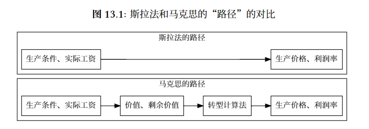

# “不必要的迂回”

## 题目

在马克思主义政治经济学体系中，劳动价值论是阐明剩余价值论及剥削了理论的重要基础。

但在斯拉法的价格方程问世之后，经济学家们发现无需劳动价值论前提，也可以计算得到利润并观察到剥削。

因此斯蒂德曼认为“劳动价值论是一个不必要的迁回”。

## 题目分析

其实斯拉法的价格方程有一定历史缘由：

1. 萨缪尔森是西方为数不多深入研究过马克思主义经济学的学者之一。萨缪尔森提出了一个价格体系模型，用于系统地推翻马克思主义经济学说。其观点主要有：

    - 价值是由供求决定的，而不是劳动时间。（价格决定价值，而不是价值决定价格）
    - 不同部门的剩余价值率通常不会相等。
    - 不同商品的价格比率通常不等于它们内含的劳动的比率。

    这些观点对马克思主义经济学的基本观点构成了直接的挑战。

2. 斯拉法以及斯蒂德曼对马克思经济学的诘难就是在这个背景下提出的。斯拉法基于萨缪尔森的价格体系模型，提出了价格方程。

    斯蒂德曼通过运用斯拉法的价格方程，得出了“正利润率可以来源于负的剩余价值”的结论。也是与马克思经济学相悖的。

由此，题目说斯拉法的价格方程是一个捷径，它绕过了马克思的劳动价值论，直接计算成本，价格，得到了商品的利润率。

我们的思路就是需要证明萨缪尔森体系的根本错误，以及斯拉法的方程的错误，从而得到劳动价值论的必要性。

## 萨缪尔森的体系

### 基本假定

1. 每个部门的生产函数都具有规模报酬不变的性质，即生产函数的比例性质不随着生产规模的变化而变化。
2. 生产部门使用劳动和资本两种投入，生产资本品和消费品两种产出
3. 资本量为量纲1，K为资本的数量，表示K个单位的资本量 **（关键）**

### 推导

$$\begin{array}{rcl}&p_1K=(wL_1+p_1K_1)(1+r)\\&p_2Y=(wL_2+p_1K_2)(1+r)\end{array}$$

$$\begin{aligned}&p_1K=(wa_1K+p_1b_1K)(1+r)\\&p_2Y=(wa_2Y+p_1b_2Y)(1+r)\end{aligned}$$

- 若用w表示工资、 $p_1$ 和 $p_2$ 分别表示资本品和消费品的价格、 $r$ 表示平均利润率，则生产$K$所消耗的劳动成本和资本成本就分别为 $wa_1K$ 和 $p_1b_1K$ ，两者之和再加上平均利润等于资本品价格总额 $p_1K$。

- 某一时期的商品与下一时期的商品的交换不是“一对一”的，还要加上相应利息$r$

$$\begin{aligned}p_1K=C_1+V_1+S_1\\p_2Y=C_2+V_2+S_2\end{aligned}$$

- 萨缪尔森将部门 1 中的 $wL_1$ 和 $p_1$ $K_1$ 分别看成是该部门中相当于马克思所说的可变资本 $V_1$ 和不变资本 $C_1$ ，并将其资本品价格总额 $p_1K$ 与投入成本( $wL_1$ + $p_1$ $K_1$ )的差额看成是剩余价值 $S_1$ ;

$$C_{2}=V_{1}+S_{1}$$

- 若考虑$K=K_1+K_2$代入，并注意到 $p_1K_1= C_1$ 和 $p_1K_2= C_2$，则立刻就可以得到马克思关于简单再生产的条件。

## 斯拉法的价格体系：

### 主要内容

可以看作是**继承**自萨缪尔森的体系。包含萨缪尔森的所有假设。

但是价格体系的计算方式有一定差异：

- 劳动力的价格（工资率）不变，不同时期的价格差只与商品价格的利率有关

    $$\begin{aligned}
    &(a_{11}p_1+\cdots a_{1n}p_n)(1+r)+l_1w&=&b_{11}p_{1}+\cdots b_{1n}p_{n}  \\
    &(a_{21}p_1+\cdotp\cdotp\cdotp a_{2n}p_n)(1+r)+l_2w&=&b_{21}p_1+\cdotp\cdotp b_{2n}p_n  \\
    &....... \\
    &(a_{\boldsymbol{n}1}p_1+\cdotp\cdotp\cdotp a_{\boldsymbol{n}\boldsymbol{n}}p_n)(1+r)+l_nw&=&b_{\boldsymbol{n}1}p_1+\cdotp\cdotp\cdotp b_{\boldsymbol{n}\boldsymbol{n}}p_n
    \end{aligned}$$

    - $a_{ij}$ 表示过程 $i$ 中商品 $j$ 的投入。
    - $b_{ij}$ 表示过程 $i$ 中商品 $j$ 的产出。
    - $l_i$ 表示过程 $i$ 中所耗费的直接劳动的数量。

    解释：这一体系并入了斯拉法对生产过程结束时对拖欠工资的通常处理方法，因此“工资基金”不是利润赖以自然增⻓的资本的一部分。

基于萨缪尔森的价格体系，拓展出价值体系。

$$\begin{array}{l}a_{11}\lambda_1+\cdots a_{1n}\lambda_n+l_1=b_{11}\lambda_1+\cdots b_{1n}\lambda_n\\a_{21}\lambda_1+\cdots a_{2n}\lambda_n+l_2=b_{21}\lambda_1+\cdots b_{2n}\lambda_n\\.........\\a_{n1}\lambda_1+\cdotp\cdotp\cdotp a_{nn}\lambda_n+l_n=b_{n1}\lambda_1+\cdotp\cdotp\cdotp b_{nn}\lambda_n\end{array}$$

- 这里价值的计算方式不再与“利率”有关，r的系数去掉了。

### 斯拉法的诘难

- 主要内容：

    1. 由于价格体系中，只要设定某一个商品的价格为基准，就可以得到其他所有商品的价格。因此，不需要劳动价值论的前提，也可以得到商品的价格。
    2. 但是在价值体系中，即使选定了一个商品的价格为基准，不一定可解得的商品价值，而且商品的价值可能是负数/0。（通过一个数例来说明，$\lambda$无定解）

### 斯蒂德曼的诘难

- 主要内容

    1. 基于斯拉法的价格&价值体系，通过另一个数例解得商品价值为负！但是利润率为正

## 与之相对的马克思：劳动价值、剩余价值论、转型计算法

### 劳动价值论

- 马克思的劳动价值论认为：

    商品的价值由生产该商品所必须的**社会必要劳动时间**决定。

    这里的“社会必要劳动时间”指的是在现有社会平均生产条件下，生产一定量商品所需的平均劳动时间。

- 马克思区分了劳动和劳动力两个概念：

    1. 劳动是价值的源泉

    2. 而劳动力则是工人出售给资本家的商品。

**价值的实质**：商品的价值不是由商品的使用价值（即商品的物理属性或满足人们需求的能力）决定的，而是由其所蕴含的人类劳动量决定的。
   

### 剩余价值理论

它揭示了资本家如何通过购买劳动力并利用其产生的劳动量超出其劳动力价值的部分（即剩余价值）来获得利润。

1. **剩余价值的来源**：在资本主义生产过程中，工人生产的商品价值超过其劳动力的价值（工资）。这部分超出的价值即为**剩余价值**，是资本家未付出相应报酬的劳动成果。
   
2. **剩余价值的形式**：剩余价值主要以两种形式存在——绝对剩余价值和相对剩余价值。

    - 绝对剩余价值通过延长工作日来实现
    
    - 而相对剩余价值则通过提高劳动生产率，即减少生产同一商品所需的劳动时间来实现。

### 转型计算法：

马克思的转型计算法是指从**价值体系**到**生产价格体系**的转换过程以及如何在不同生产部门间实现**利润率的平均化**。

1. **价值到生产价格的转化**：马克思开始于商品的价值，即直接和间接劳动的总和。然而，在资本主义市场中，商品通常不是按其价值交换，而是按生产价格交换。价格交易体系保证了不同资本投资得到相同平均利润率的条件下的交易价格相同。

2. **剩余价值到平均利润的转化**：所有部门生产的总剩余价值等于总利润。这个总利润按照资本量的比例在不同生产部门中分配（而不是根据各自创造的剩余价值量）。这导致了利润率的平均化。

3. **生产价格的形成**：通过上述转换，生产价格可以视为由三部分组成：恒定资本和可变资本的成本价，加上平均利润。这一价格保证了不论部门间劳动生产力和资本构成的差异如何，所有资本家都能获得相同比例的利润。

### 转型计算法与生产价格/利润率的关系：

转型计算法揭示了生产价格和平均利润率不是随意确定的，而是基于劳动价值论和剩余价值论的逻辑延伸。它表明，在资本主义经济中，商品的交换和价值实现受到资本积累和竞争的影响，导致生产价格通常不等于劳动价值，而是包含了平均化后的利润部分，这一过程体现了资本主义市场经济的内在规律和矛盾。

## 斯拉法主义与马克思经济学的对比

## 反批判

### 萨缪尔森体系的错误

萨缪尔森给出的模型 (特别是他的价值体系) 存在很多的混乱和错误。而斯拉法也同样继承了他的错误。

1. 萨缪尔森说马克思从价值作为研究的起点站不住脚：

    实际上，马克思明确说过“只有商品价格的分析才导致价值量的决定，只有商品共同的货币表现才导致商品的价值性质的确定。
    
    只不过在马克思那里，从对价格的分析深入到价值，仅仅只是研究过程的一个方面，一旦这个方面完成，就需要反过来，从价值推导出价格。

2. 其次，萨缪尔森的全部推论所赖以成立的基础或出发点，即他的实物关系是不现实的。

    因为它假定了充分就业;而在马克思那里，失业却是资本主义社会的“常态”。

    所以，社会总可用劳动力的浮动，导致了萨缪尔森的实物关系与价格的不稳定。

    而萨缪尔森又将价格作为一切的基础，所以他的体系就是不稳定的。

    供求关系本身显然并不能够解决这一不确定性，因而，仍然需要价值来建立价格的基础。

3. 萨缪尔森根据其价格体系所倒推出来的价值体系是不正确的。

    我们可以从如下几个方面来说明这一点。
    
    1. 如前所说，在萨缪尔森的公式中，C和V是以价格而非价值来计量的不变资本和可变资本, S是平均利润而非剩余价值。
    
        这意味着，萨缪尔森在由其价格体系倒推价值体系时，实际上是在后者的各个项目中直接用价格取代了价值。这种做法显然是不妥的，除非事先假定两者总是相等的但这一点却正好是需要加以证明(或证伪)的。

    2. 与前一点相应，萨缪尔森得到的公式 $C_2=V_1+S_1$ ,实际上是价格而非价值体系的简单再生产条件。
    
    3. 在萨缪尔森的简单再生产条件 $C_2=V_1+S_1$ 中,等式左右两边的项目实际上是不能直接交换的，因为在这里，$C_2=p_1K_2$ 是部门2中投入的资本品的成本,而$V_1=wL_1$,却不是部门1中投入的消费品的成本，而是劳动的成本，但我们知道，与部门2中的资本品相交换的是部门1中的消费品，而不是它使用的劳动。
    
        因此，即使把萨缪尔森的上述简单再生产条件看成是价格体系的，它也是虚假的和没有意义的除非我们进一步把劳动成本转化为相应的消费品的成本。
    
    4. 也是前面提到过的，萨缪尔森提出的表达式$S/V$，不是马克思定义的剩余价值率，因为分子中的S如前所说是平均利润而非剩余价值。
    
    5. 在萨缪尔森模型中，不仅存在着资本品和消费品及相应的价格，而且还有劳动及工资，而在马克思的再生产图式中，只有资本品和消费品及相应的价格，而没有劳动及工资。劳动和工资是“隐藏”在再生产图式背后的。

### 斯拉法体系与斯蒂德曼的错误

除了上述萨缪尔森体系的错误，斯拉法的体系及其举出的数例也存在一些问题：

1. 与上述萨缪尔森体系的错误相同，将可变资本和剩余价值混淆在了一起，并都将其视为1单位劳动的报酬。

    劳动力价值的工资包含了两部分：一部分是可变资本，另一部分是剩余价值。
    
    也就是说：1单位劳动创造的价值的剩余部分以剩余价值m的形式被资本家占有了。
    
    而斯拉法的体系中，将这两部分混淆在了一起。

    但是实际上，工人付出1单位的劳动，只能获得相对应的、等于其自身劳动力价值的工资w。
    
2. 在两个数例中，给出的两个生产过程利润率并不相等，但联立方程的操作默认了两者在社会上占比相同。

    过程1和过程2都投入1的劳动力，但：
    
    - 过程1中，1单位劳动的净产出是**1单位商品1和1单位商品2**；

    - 过程2中，1单位劳动的净产出是**3单位商品1和2单位商品2**。

    **这意味着生产过程2的效率要比生产过程1高。**
    
    全社会已经不合理地把过多的劳动投入到生产过程1而不是相对先进的生产过程2中！

3. 第2点的更深入分析：斯蒂德曼的方程组中，所谓的商品价值不由“社会必要劳动时间”决定，而是由“个别劳动时间” 决定，这与劳动价值论的说法相距甚远。 

    劳动价值论认为，商品的价值由生产该商品所必须的**社会必要劳动时间**决定。

    我们可以是视投入到生产过程2的劳动是较复杂劳动，投入到生产过程1的是较简单劳动。

    为了保证两个过程利润率相同，如果过程2中的1单位复杂劳动被假定为可以折算成2.45个单位的简单劳动，同时1单位简单劳动的价值仍被设为是1。

    则可解得两个商品的价值都为正。

    所以斯拉法的价值方程组中，商品的价值不由“社会必要劳动时间”决定，而是由“个别劳动时间” 决定，这与劳动价值论的说法相距甚远。

### 与参考命题的联系以及反驳

- 参考命题：

    1. 只要劳资不平等就能够定义剥削，为什么一定要说价值全部是劳动创造的呢？概括一下就是剩余价值和剥削的存在并不一定要以劳动价值论为基础，所以劳动价值论就是“不必要的迁回”。
    
    2. 生产资料更容易集中，工人并不容易团结，所以集中控制生产资料的资本家有议价权，进而产生剥削；工人团结起来建立强大的工会组织也会减轻剥削。可见，是否存在剥削取决于劳资双方的议价权，双方的议价权分别取决于生产资料和劳动力的集中程度。所以并不需要劳动价值论就可以定义剥削。

- 反驳：

    1. 劳资不平等实际上指的是工资与商品价格的差异，本质上是从价格出发的。

        而价格出发的体系就是萨谬尔森的体系或者斯拉法的体系，它的错误与萨缪尔森（第1、2点）、斯拉法（第1、3点）相同。
        
        劳资之差只是表现在价格上，而不是价值上。剥削的定义是基于价值的，不论商品价格如何波动，工资的涨跌，剥削都必定存在。

        而如果只用价格体系计算“剥削”，那么就会出现斯拉法的错误：将工资、剩余价值与可变资本混为一谈，导致计算上的错误（出现价值为负数/0的情况）。

    2. 与第1点相似，劳资双方的议价权也是基于价格的，而不是价值。

        价值是基于社会平均劳动力水平的，是稳定的。剥削的定义是基于价值的，不论商品价格如何波动，工资的涨跌，剥削都必定存在。

        如果剥削基于价格而不是价值，那么就会出现斯拉法的错误：将工资、剩余价值与可变资本混为一谈，导致计算上的错误（出现价值为负数/0的情况）。

## 辩论思路

### 引入

- 开始时可以简要介绍马克思劳动价值论的核心观点，即商品的价值由**社会必要劳动时间决定**，并且这一理论是理解剩余价值和资本主义剥削本质的基础。
- 接着从反方观点入手，即斯拉法体系认为可以不借助劳动价值论而直接从生产价格计算利润，从而观察到剥削。抓住“利润”（价格）与“价值”的根本区别，引出本次辩论的核心问题：价格与价值的根本不同。

### 论述顺序

1. **批判萨缪尔森体系的基本假设错误**：

    先简单介绍“不必要迂回”这个问题的历史，并简要介绍萨缪尔森是如何从价格入手计算剥削的。

    再从萨缪尔森的基本假设开始，指出其对市场价格形成机制的误解，特别是忽略了资本主义生产中的失业常态和劳动力市场的动态变化。

2. **揭露斯拉法价格方程的问题**：

    深入分析斯拉法体系，特别是其价格方程如何继承了萨缪尔森体系的错误，并进一步展示其在逻辑上的不足，如通过具体数例指出“正利润率可以来源于负的剩余价值”的逻辑悖论。

3. **阐述劳动价值论和剩余价值论的必要性**：

    回应反方观点，强调劳动价值论不仅为剩余价值的计算提供了理论基础，而且深刻揭示了资本主义生产方式的内在矛盾和剥削本质。

4. **对比劳动价值论与斯拉法主义的不同路径**：

    利用图表，清晰对比劳动价值论与斯拉法主义在计算价格和利润率方面的不同，强调劳动价值论的合理性和必要性。

    